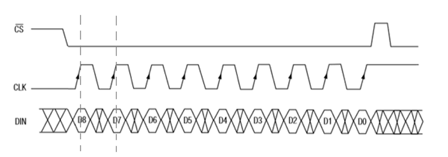

A dot matrix LED driver needs three control lines such as chip select (¯CS), clock (CLK) and data-in (DIN) to control the operation of the chip. The DIN line holds 9 bits of data that should be clocked-in to the chip as shown in Figure 2.1. Please note that the DIN data has to be available at the rising edge of the CLK to accept the data by chip. ¯CS has to take logic low before clocking any data. After clocking all the bits starting from D8 to D0 last, the CS line should go logic high. 

Write the assembly compatible with MSP430 microcontroller to clock the given nine bits of data. You are strongly requested to use left/right shift operations associated with any logic function to get this work. 
